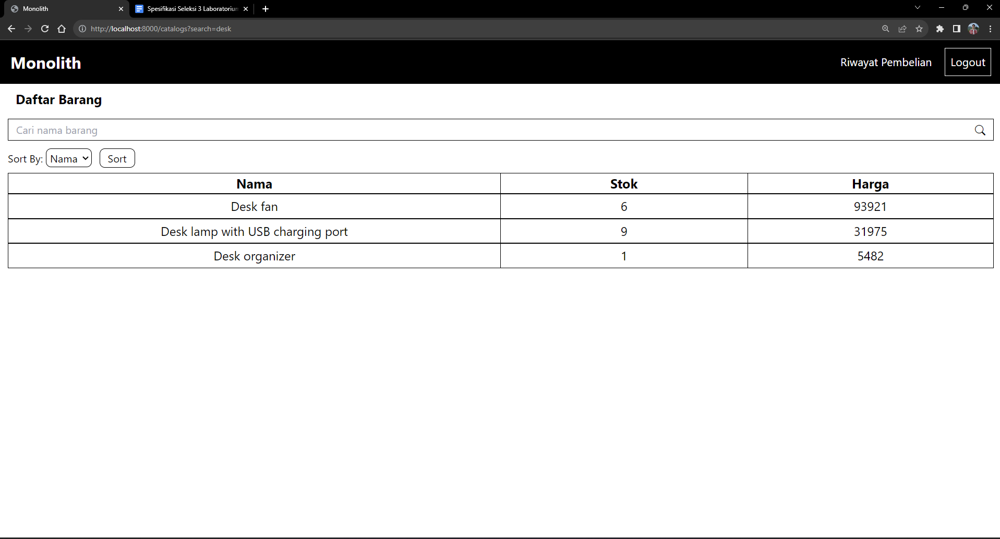

# Monolith

## Daftar Isi

-   [Nama & Nim](#nama--nim)
-   [Cara Menjalankan](#cara-menjalankan)
-   [Design Pattern](#design-pattern)
-   [Tech Stack](#tech-stack)
-   [Endpoint](#endpoint)
-   [Bonus](#bonus)
    -   [Responsive Layout](#responsive-layout)
    -   [Fitur Tambahan](#fitur-tambahan)
    -   [Lighthouse](#lighthouse)

## Nama & NIM

Dibuat oleh Rasyadan Faza Safiqur Rahman (18221103)

## Cara Menjalankan

1. Pastikan Docker dan Docker Compose sudah terinstall

```sh
docker -v
docker compose version
```

2. Pastikan container [Single Service](https://github.com/rasyadanfz/single-service) sudah berjalan
3. Clone repository ini dengan menjalankan command

```sh
git clone https://github.com/rasyadanfz/monolith.git
```

4. Buka folder monolith di terminal

```sh
cd monolith
```

5. Jalankan dengan command

```sh
`make init`
```

Jika tidak dapat menjalankan makefile, command tersebut dapat diganti dengan

```sh
docker network create app_network
docker compose build --no-cache
docker compose up -d
docker exec -it --user=root monolith-monolith_app-1 chmod -R 777 /var/www/storage
docker exec monolith-monolith_app-1 bash -c "composer install"
docker exec monolith-monolith_app-1 bash -c "php artisan migrate:fresh --seed"
```

Jika terdapat error ketika menjalankan command pertama, ignore saja error tersebut

5. Monolith dapat diakses pada URL http://localhost:8000

## Design Pattern

1. **Factory**

    Design pattern Factory digunakan untuk membuat data dalam proses seeding. Data user dan data riwayat pembelian diciptakan menggunakan factory masing-masing yang memiliki implementasi masing-masing dan merupakan turunan dari sebuah abstract class Factory.

2. **Singleton**

    Design pattern Singleton digunakan untuk instansiasi Http Client. Hal ini dilakukan agar seluruh fetching data dari API Single Service konsisten dan hanya melalui satu Client saja.

3. **Decorator**

    Design pattern Decorator digunakan untuk menambah fungsionalitas retry pada Http Client sehingga Client dapat mencoba beberapa kali jika gagal dalam mengakses database. Hal ini bertujuan untuk meningkatkan reliabilitas aplikasi seandainya terjadi error dalam pengaksesan database.

## Tech Stack

Dalam pengembangan Monolith, berikut adalah Technology Stack yang digunakan

-   Laravel Framework v10.15.0
-   Nginx v1.25.1
-   MySQL v5.7
-   Tailwind CSS v3.3

## Endpoint

Berikut adalah endpoint yang dibuat

-   GET /
-   GET /catalogs
-   GET /item/{id}
-   GET /purchase/{id}
-   POST /purchase
-   GET /history
-   GET /register
-   POST /users
-   GET /login
-   POST /login
-   POST /logout

## Bonus

### Responsive Layout

Berikut adalah cuplikan tampilan responsive pada web

-   Mobile


-   Dropdown Navbar Mobile


-   Desktop


### Fitur Tambahan

-   Fungsionalitas search pada katalog barang

    

-   Fungsionalitas sort berdasarkan nama, stok, atau harga pada katalog barang

    

### Lighthouse

-   **Homepage**

    

-   **Register**

    

-   **Login**

    

-   **Katalog Barang**

    

-   **Detail Barang**

    

-   **Beli Barang**

    

-   **Riwayat Pembelian**

    
